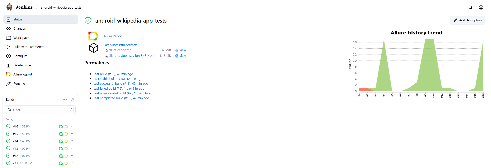
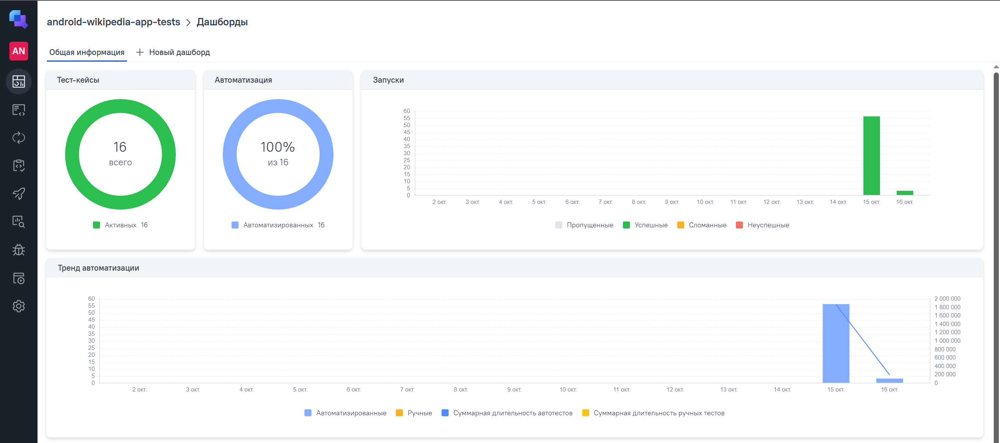
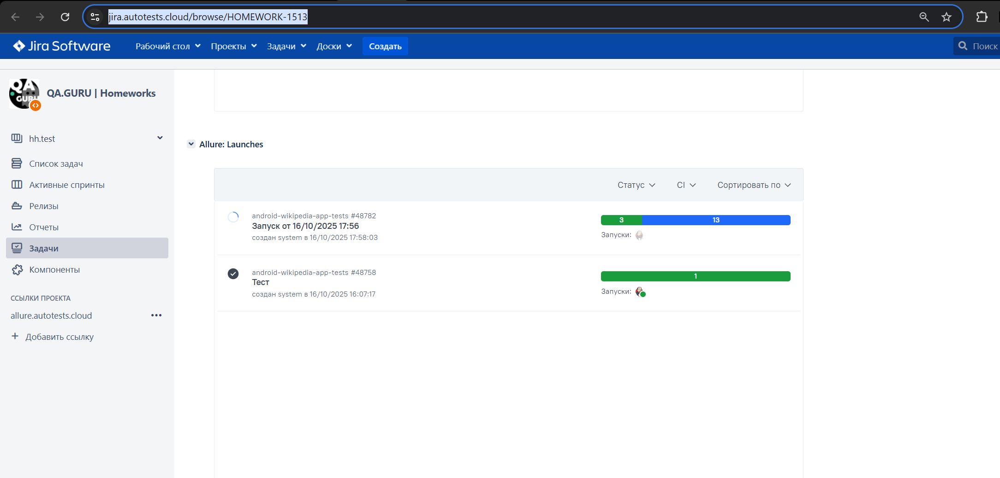
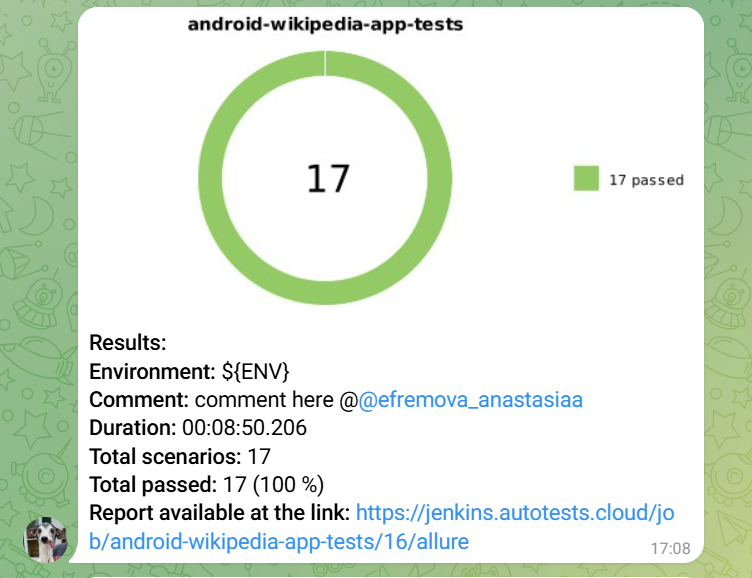
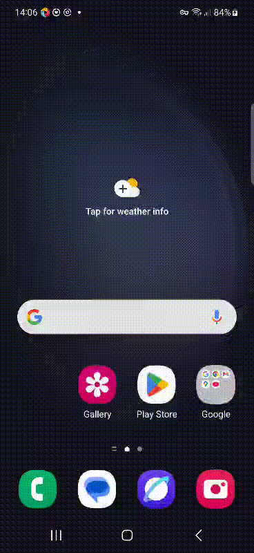

# Проект автоматизации тестирования для Wikipedia Android Mobile App


> Проект автоматизированного тестирования мобильного приложения Wikipedia для Android.

## 📋 О проекте

Проект включает автоматизированные тесты для мобильного приложения Andriod Wikipedia, охватывающие:

- Полный flow онбординга пользователя;

- Настройку языков и выбор локализации;

- Валидацию UI компонентов на всех экранах;

- Интеграционное тестирование пользовательских сценариев.

---

## 📚 Содержание

- [Технологии и инструменты](#технологии-и-инструменты)
- [Архитектура тестов](#архитектура-тестов)
- [Тест-кейсы](#тест-кейсы)
- [Запуск тестов](#запуск-тестов)
- [Сборка в Jenkins](#-сборка-в-jenkins)
- [Allure отчет](#-allure-отчет)
- [Интеграция с TestOps](#-интеграция-с-testops)
- [Интеграция с Jira](#-интеграция-с-jira)
- [Телеграмм-бот с уведомлениями о результатах тестов](#-телеграмм-бот-с-уведомлениями-о-результатах-тестов)
- [Пример записи видео при выполнении тестов в Selenoid](#-пример-записи-видео-при-выполнении-тестов-в-selenoid)

---

<a id="технологии-и-инструменты"></a>
## 🛠 Технологии и инструменты

<p align="center">  
<a href="https://www.jetbrains.com/idea/"></a>  
<a href="https://www.java.com/"></a>  
<a href="https://github.com/"></a>  
<a href="https://junit.org/junit5/"></a>  
<a href="https://gradle.org/"></a>  
<a href="https://selenide.org/"></a>  
<a href="https://aerokube.com/selenoid/"></a>
<a href="https://qameta.io/"></a>   
<a href="https://www.jenkins.io/"></a>  
<a href="https://www.atlassian.com/ru/software/jira/"></a>  
</p>

---

<a id="архитектура-тестов"></a>
## 🏗 Архитектура тестов

```bash
src/test/java/
├── config/                  # Конфигурационные классы
│   ├── BrowserstackConfig.java
│   └── LocalConfig.java
├── drivers/                # Драйверы для разных окружений
│   ├── BrowserstackDriver.java
│   └── EmulationDriver.java
├── helpers/               # Вспомогательные классы
│   └── AttachHelper.java
├── screens/               # Screen Object модели экранов
│   ├── AddALanguageScreen.java
│   ├── BookmarksScreen.java
│   ├── DiscoveryScreen.java
│   ├── MainScreen.java
│   ├── PrivacyScreen.java
│   ├── WelcomeScreen.java
│   └── WikipediaLanguagesScreen.java
└── tests/                 # Тестовые классы
    ├── TestBase.java
    └── onboardingTests/   # Тесты онбординга
        ├── BookmarksScreenTests.java
        ├── CompleteOnboardingIntegrationTest.java
        ├── DiscoveryScreenTests.java
        ├── LanguageSettingsScreenTests.java
        ├── PrivacyScreenTests.java
        └── WelcomeScreenTests.java
````


---

<a id="тест-кейсы"></a>
## ✅ Тест-кейсы

🎯 Welcome Screen Тесты
✓ Проверка отображения логотипа Wikipedia

✓ Проверка текстов заголовков

✓ Проверка наличия языка по умолчанию

✓ Проверка кнопок Skip и Continue

✓ Переход к экрану Discovery

✓ Навигация к настройкам языка

🔍 Discovery Screen Тесты
✓ Проверка элементов экрана Discovery

✓ Валидация текстов описания

✓ Проверка изображения

✓ Переход к экрану Bookmarks

✓ Пропуск онбординга

📚 Bookmarks Screen Тесты
✓ Проверка элементов экрана Bookmarks

✓ Валидация текста "Reading lists with sync"

✓ Переход к экрану Privacy

✓ Пропуск онбординга

🔒 Privacy Screen Тесты
✓ Проверка элементов экрана Privacy

✓ Валидация текста "Data & Privacy"

✓ Проверка кнопки "Get started"

✓ Завершение онбординга

🌐 Language Settings Тесты
✓ Проверка экрана выбора языка

✓ Навигация к добавлению языка

✓ Проверка списка языков

✓ Выбор конкретных языков (параметризованный тест)

🔄 Интеграционные тесты
✓ Полный flow онбординга: Welcome → Discovery → Bookmarks → Privacy → Main

✓ Проверка корректности переходов между экранами

---

<a id="запуск-тестов"></a>
## 🚀 Запуск тестов

### Локальный запуск на эмуляторе
```bash
./gradlew clean test -DdeviceHost=emulator
```
### Локальный запуск на BrowserStack
```bash
./gradlew clean test -DdeviceHost=browserstack
```
### Запуск тестов с определенными тегами (если не указать device, то по умолчанию будет browserstack)
```bash
smoke_tests
./gradlew clean welcome_tests
./gradlew clean discovery_tests
./gradlew clean bookmarks_tests
./gradlew clean privacy_tests
./gradlew clean languages_tests
./gradlew clean regression_tests
```

##  Сборка в Jenkins
[Сборка в Jenkins](https://jenkins.autotests.cloud/job/android-wikipedia-app-tests/16/)
<p align="center">
    
</p>

##  Allure-отчет
[Allure отчет](https://jenkins.autotests.cloud/job/android-wikipedia-app-tests/16/allure/)
<p align="center">
    
</p>

##  Интеграция с TestOps
[Интеграция с TestOps](https://allure.autotests.cloud/project/4952/dashboards)
<p align="center">
    
</p>

##  Интеграция с Jira
[Интеграция с Jira](https://jira.autotests.cloud/browse/HOMEWORK-1513)
<p align="center">
    
</p>

##  Телеграмм-бот с уведомлениями о результатах тестов
<p align="center">

</p>

###  Пример записи видео при выполнении тестов
<p align="center">
 
</p>

